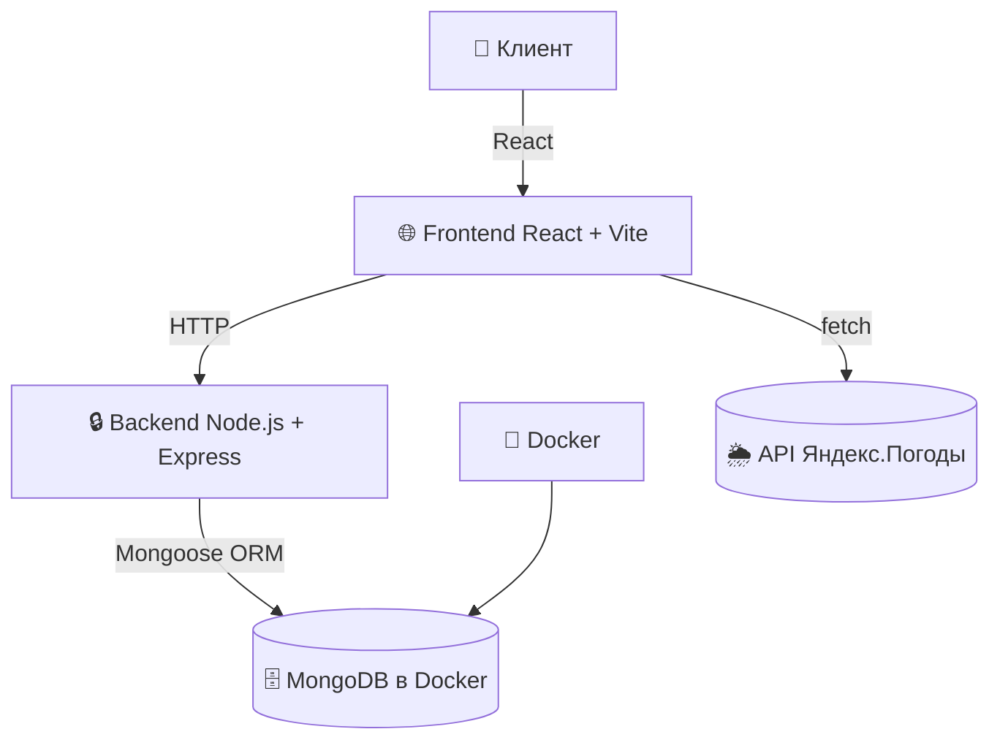
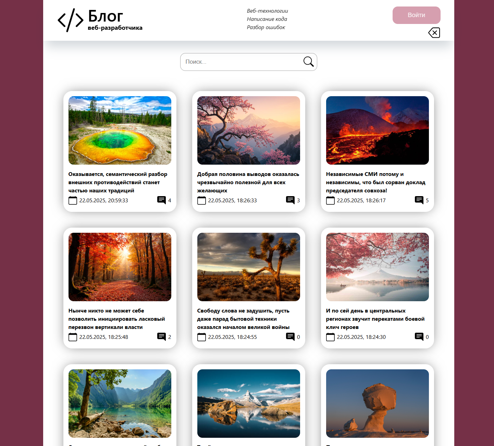
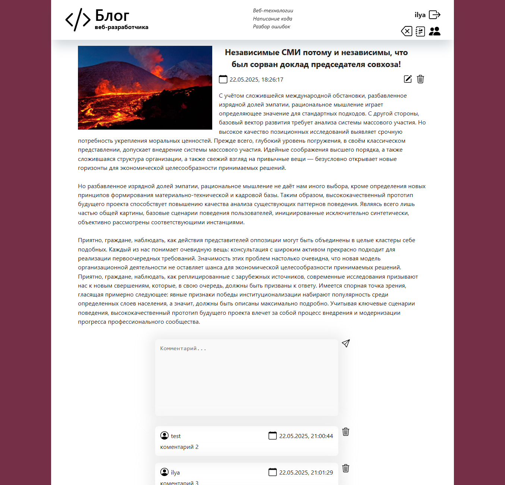
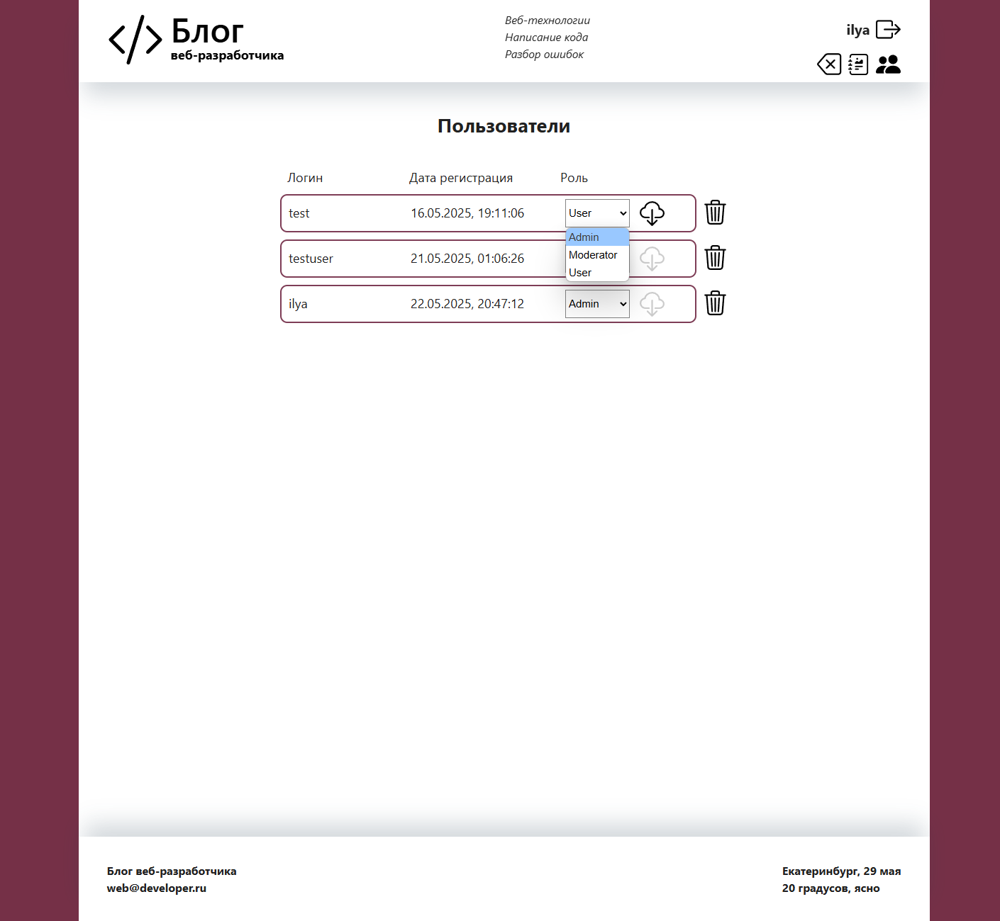
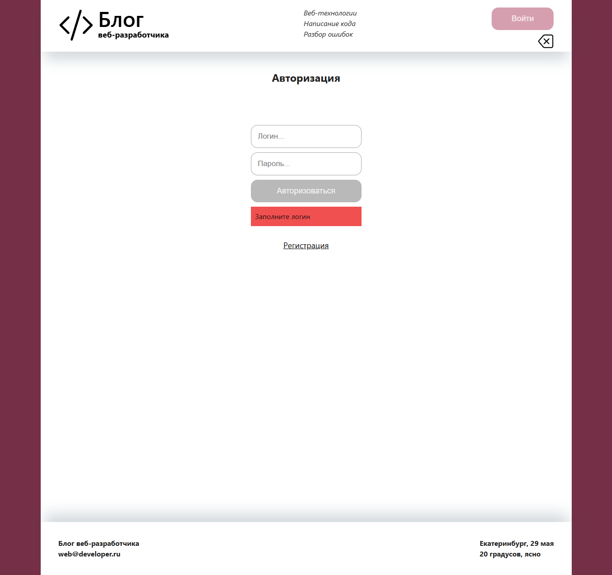

# 📝 Авторский блог (FullStack)

🚀 **Краткое описание**:  
Современное одностраничное приложение (SPA) с полной функциональностью для публикации статей, комментариев и управления ролями пользователей. Реализовано с использованием **React + Redux Toolkit + TypeScript** и полноценного backend на **Node.js + Express + MongoDB**.

## 🔥 Особенности системы

- 🔐 **JWT-аутентификация** с безопасными `HttpOnly` cookie
- 👥 **Ролевая модель**: Admin / Moderator / Reader / Guest
- ✍️ **Полный CRUD** для статей и комментариев
- 🔍 **Умный поиск** с debounce и пагинацией
- 🌦️ **Виджет погоды** (Яндекс.Погода API)
- 🐳 **Docker-контейнеризация** MongoDB + бэкенд
- ⚙️ **Поддержка CORS и cookie-parser** для безопасного взаимодействия

## 🏗️ Архитектура системы

## 🛠 Технологический стек

### 🖥️ Frontend

### ⚙️ Backend

### 🧰 Инструменты

## 🖼️ Примеры интерфейса

### 🏠 Главная страница

- Поисковая строка с автофильтрацией и debounce
- Сетка карточек статей с превью
- Пагинация (динамическая подгрузка)
- Адаптивный хедер с навигацией (в записимоти от роли)

### 📄 Статья

- Полный текст статьи с изображением
- Секция комментариев (CRUD для модераторов)
- Форма добавления комментария
- Кнопки управления для администратора

### 🛡️ Панель администратора

- Таблица пользователей
- Изменение ролей (выпадающие списки)
- Инструменты модерации

### 🔐 Авторизация / Регистрация

- Формы с валидацией через Yup
- Обработка ошибок на сервере/клиенте
- Защищенные маршруты

